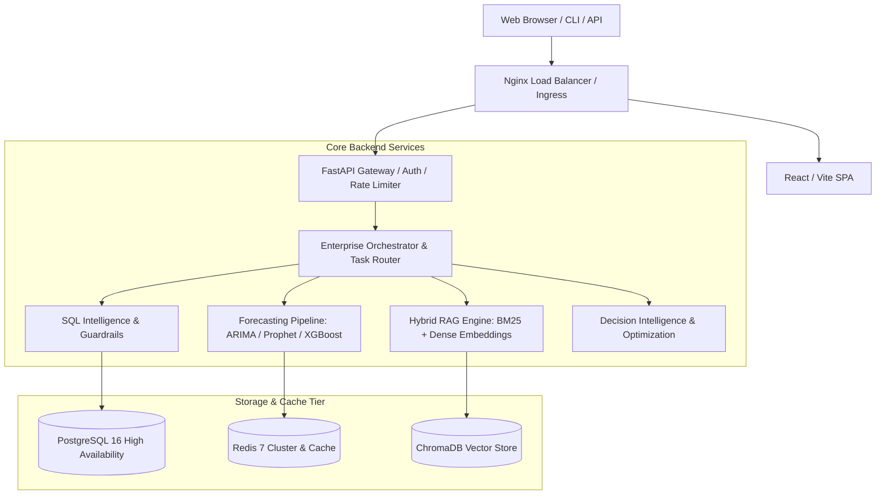

# AI Data Analyst OS — System Architecture

## Architecture Overview
The platform uses a layered micro-modular architecture optimized for low-latency analytics, high-throughput time-series forecasting, and natural language question answering.

---

## Component Breakdown

1. **Ingress & Load Balancer**:
   - SSL termination and HTTP/2 proxying via Nginx.
   - Rate limiting (120 req/min with burst buffer).

2. **Frontend Layer**:
   - React with Vite, state management via lightweight hooks, real-time KPI dashboards, and interactive chart visualizations.

3. **Backend API Gateway**:
   - FastAPI asynchronous runtime.
   - JWT authentication, RBAC authorization, and request telemetry metrics.

4. **Intelligence Tier**:
   - **SQL Agent**: Translates English questions to ANSI SQL with 100% destructive mutation blocking.
   - **RAG Engine**: Hybrid retrieval combining BM25 keyword matching with dense embeddings.
   - **Forecasting Engine**: Auto-selects between Auto-ARIMA, Facebook Prophet, and XGBoost based on historical cross-validation.
   - **Decision Engine**: Generates actionable business recommendations, cost optimizations, and pricing adjustments.

5. **Data & Persistence Layer**:
   - **PostgreSQL 16**: Primary transaction store, datasets metadata, and audit logging.
   - **Redis 7**: Distributed caching, token blacklists, and rate-limiting counters.
   - **ChromaDB**: Semantic vector embeddings store for documentation and unstructured text.
